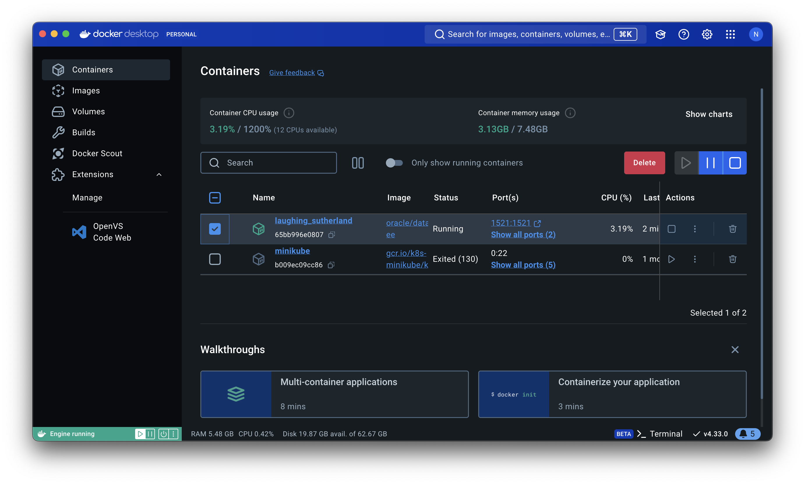

# 目的
- SQLの実行計画の見方
- インデックスの作成方法と効果測定

# 前提条件
こちらのカリキュラムは前回の`oracle-study`で使用した環境を前提としています。

https://github.com/NakamuraYosuke/oracle-study

# ハンズオンの流れ
- AUTOTRACE機能を有効化するためのPLUSTRACE権限の付与
- 共有プールのクリア
- サンプルSQLを元にした実行計画の見方
- 改善箇所の検討
- インデックスの付与
- 改善結果考察

# 事前準備
Docker Desktopアプリを起動し、前回の演習で作成したOracle Databaseコンテナを起動します。


実行計画を確認するためにAUTOTRACE機能を使います。
AUTOTRACEはSQL*Plusの機能で、SQLの実行計画、および実行時に必要としたシステムリソースなどを簡単に確認することができます。また、SQLトレースには含まれないメモリソート、ディスクソートの発生回数なども確認できます。

## 権限付与
AUTOTRACEを利用するには、`PLUSTRACE`というロールが必要になります。
SYSDBA権限を持つユーザでログインし、ロールを有効化します。
```
sqlplus sys@ORACLE as sysdba
```
```
@?/sqlplus/admin/plustrce
```

以前作成した`HR`ユーザに対して`PLUSTRACE`ロールを付与します。
```
GRANT PLUSTRACE TO HR;
```

## 共有プールのクリア
以前に実行したSQLの情報が共有プールに残っている可能性があるため、共有プールを空にします。
```
ALTER SYSTEM FLUSH SHARED_POOL;
```

# 改善前の実行計画の取得
以前作成した`HR`ユーザでログインします。
```
CONN HR@ORACLE
```
AUTOTRACE機能を有効化します。
```
SET AUTOTRACE ON
```
> [!TIP]
AUTOTRACEはONとする場合はSQLの結果と実行計画が出力されます。
実行計画のみ出力する場合はTRACEONLYとして指定します。

以前に実行した、EMPLOYEESテーブルにあるSALARYが最も高い従業員の情報を取得するSQLを実行します。
```
SELECT EMPLOYEE_ID,FIRST_NAME,LAST_NAME,SALARY FROM EMPLOYEES WHERE SALARY = (SELECT MAX(SALARY) FROM EMPLOYEES);
```

以下の実行計画が出力されます。
```
Execution Plan
----------------------------------------------------------
Plan hash value: 1945967906

---------------------------------------------------------------------------------
| Id  | Operation	    | Name	| Rows	| Bytes | Cost (%CPU)| Time	|
---------------------------------------------------------------------------------
|   0 | SELECT STATEMENT    |		|     1 |    52 |     6   (0)| 00:00:01 |
|*  1 |  TABLE ACCESS FULL  | EMPLOYEES |     1 |    52 |     3   (0)| 00:00:01 |
|   2 |   SORT AGGREGATE    |		|     1 |    13 |	     |		|
|   3 |    TABLE ACCESS FULL| EMPLOYEES |   107 |  1391 |     3   (0)| 00:00:01 |
---------------------------------------------------------------------------------

Predicate Information (identified by operation id):
---------------------------------------------------

   1 - filter("SALARY"= (SELECT MAX("SALARY") FROM "EMPLOYEES"
	      "EMPLOYEES"))

Note
-----
   - dynamic statistics used: dynamic sampling (level=2)


Statistics
----------------------------------------------------------
	121  recursive calls
	  0  db block gets
	227  consistent gets
	  0  physical reads
	  0  redo size
	804  bytes sent via SQL*Net to client
	474  bytes received via SQL*Net from client
	  2  SQL*Net roundtrips to/from client
	  6  sorts (memory)
	  0  sorts (disk)
	  1  rows processed
```

実行計画を見ると、EMPLOYEESテーブルに対して`TABLE ACCESS FULL`となっています。
これにより、フルスキャンが発生していることがわかります。

> [!NOTE]
> なぜフルスキャンが発生しているのか考えてみましょう。

## 共有プールのクリア
フルスキャンの改善に向けた対処の準備をします。

AUTOTRACE機能を無効化し、SYSDBA権限を持つユーザでログインし、再度共有プールを空にします。
```
SET AUTOTRACE OFF
CONN SYS AS SYSDBA
ALTER SYSTEM FLUSH SHARED_POOL;
```

> [!IMPORTANT]
> 先ほど実行した参照クエリでは、副問い合わせ句でMAX(SALARY)として最大値を検索しているため、SALARYの値を全てサーチしています。
> 
> SALARYの値を全てサーチすることはCPUコストを上げてしまい、SQLのパフォーマンスを下げる要因となってしまいます。
> 
> そのため、SALARYカラムに対してインデックスを作成し、パフォーマンスが改善し実行計画がどのように変化するかを確認します。

# インデックスの作成
HRユーザでログインします。
```
CONN HR@ORACLE
```
`EMPLOYEES`テーブルの`SARALY`カラムに対して、`IDX_EMPLOYEES_SARALY`という名前のインデックスを作成します。
```
CREATE INDEX IDX_EMPLOYEES_SALARY ON EMPLOYEES (SALARY);
```

> [!TIP]
> インデックスを作成した場合や大量のデータをインサートした場合には、オプティマイザ統計情報を取得した方が良い場合があります。
>
> オプティマイザ統計はテーブルやインデックスのメタデータであり、レコード数、列の最大値や最小値、データの分散、ブロック数等の情報になります。
> SQL文が実行されるためには実行計画の作成が必要です。実行計画はデータへのアクセス方法（テーブルを直接参照、インデックス経由で参照）、結合方法（Nested Loop, Merge, Hash）、結合順序、パラレル・クエリーの使用等を SQL 文毎に作成された情報です。
> 
> この実行計画を作成するためにオプティマイザ統計情報が使われます。
> 
> 本カリキュラムでは扱いませんが、詳細は下記を参考にしてください。
> https://docs.oracle.com/cd/F19136_01/arpls/DBMS_STATS.html#GUID-01FAB8ED-E4A3-4C3E-8FE2-88717DCDDA06
 
# 改善後の実行計画の取得
AUTOTRACEを有効化し、再度参照クエリを実行します。
```
SET AUTOTRACE ON
```

```
SELECT EMPLOYEE_ID,FIRST_NAME,LAST_NAME,SALARY FROM EMPLOYEES WHERE SALARY = (SELECT MAX(SALARY) FROM EMPLOYEES);
```

```
Execution Plan
----------------------------------------------------------
Plan hash value: 158051583

------------------------------------------------------------------------------------------------------------
| Id  | Operation			    | Name		   | Rows  | Bytes | Cost (%CPU)| Time	   |
------------------------------------------------------------------------------------------------------------
|   0 | SELECT STATEMENT		    |			   |	 1 |	52 |	 3   (0)| 00:00:01 |
|   1 |  TABLE ACCESS BY INDEX ROWID BATCHED| EMPLOYEES 	   |	 1 |	52 |	 2   (0)| 00:00:01 |
|*  2 |   INDEX RANGE SCAN		    | IDX_EMPLOYEES_SALARY |	 1 |	   |	 1   (0)| 00:00:01 |
|   3 |    SORT AGGREGATE		    |			   |	 1 |	13 |		|	   |
|   4 |     INDEX FULL SCAN (MIN/MAX)	    | IDX_EMPLOYEES_SALARY |	 1 |	13 |	 1   (0)| 00:00:01 |
------------------------------------------------------------------------------------------------------------

Predicate Information (identified by operation id):
---------------------------------------------------

   2 - access("SALARY"= (SELECT MAX("SALARY") FROM "EMPLOYEES" "EMPLOYEES"))

Note
-----
   - dynamic statistics used: dynamic sampling (level=2)


Statistics
----------------------------------------------------------
	 24  recursive calls
	  0  db block gets
	 35  consistent gets
	  0  physical reads
	  0  redo size
	804  bytes sent via SQL*Net to client
	474  bytes received via SQL*Net from client
	  2  SQL*Net roundtrips to/from client
	  0  sorts (memory)
	  0  sorts (disk)
	  1  rows processed
```

# 評価
`TABLE ACCESS FULL`から`INDEX RANGE SCAN`に変わっており、作成したインデックスが正しく利用されていることが確認できます。

> [!NOTE]
> recursive calls（Oracle内部の再帰SQLの実行回数）やconsistent gets（読み取りブロック数）の値はどのように変化しているでしょうか。
>
> また、これら値の変化からインデックス作成はどのような効果があると評価できるでしょうか。

>　[!IMPORTANT]
`consintenst gets`や`physical reads`の数値を小さくすることでSQLの実行時間を短くでき性能向上が見込めます。
>
> 本カリキュラムで実施したインデックスの付与だけでなく、チューニングにはテーブルの結合順序の制御など様々な手法があります。

